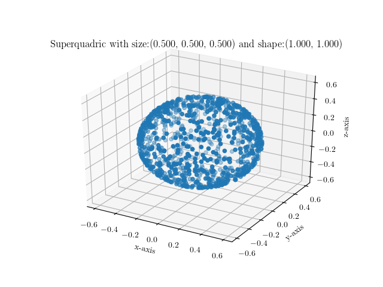
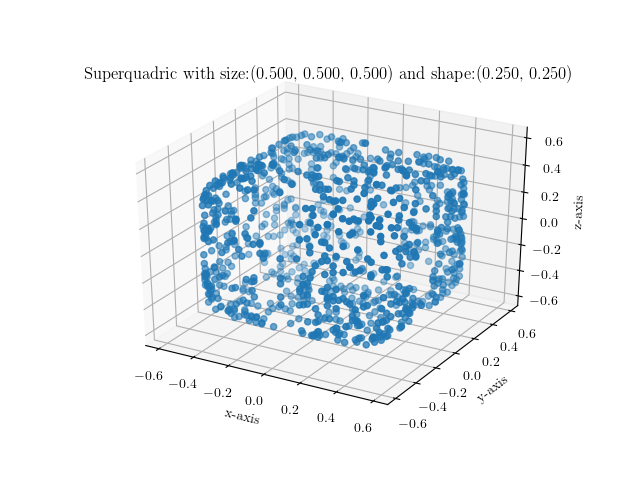
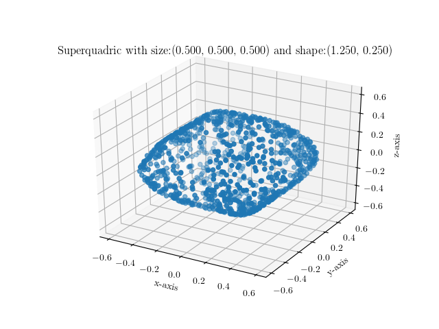

## Superquadrics Revisited: Learning 3D Shape Parsing beyond Cuboids

This repository contains the code that accompanies our CVPR 2019 paper
[Superquadrics Revisited: Learning 3D Shape Parsing beyond Cuboids](https://arxiv.org/pdf/1904.09970.pdf)


You can find detailed instructions for both training your own models and using
pretrained models in the examples below.

Dependencies & Installation
----------------------------

Our library has the following dependencies:

- Python 2.7
- [PyTorch](https://pytorch.org/get-started/locally/)
- torchvision
- numpy
- [scikit-learn](https://scikit-learn.org/stable/install.html)
- [progress](https://pypi.org/project/progress/)
- [pyquaternion](http://kieranwynn.github.io/pyquaternion/)
- [trimesh](https://github.com/mikedh/trimesh)
- [backports.functools_lru_cache](https://pypi.org/project/backports.functools_lru_cache/)
- [Cython](https://cython.readthedocs.io/en/latest/src/quickstart/install.html)
- [sympy](https://pypi.org/project/sympy/)
- seaborn
- matplotlib
- [PIL](https://pillow.readthedocs.io/en/stable/installation.html#basic-installation)
- [mayavi](https://docs.enthought.com/mayavi/mayavi/installation.html#installing-with-pip)

They should be automatically installed by running
```
pip install --user -e .
```

In case you this doesn't work automatically try this instead,
```
pip install -r requirements.txt
pip install --user -e .
```

Please note that you might need to install `python-qt4` in order to be able to
use mayavi. You can do that by simply typing
```
sudo apt install python-qt4
```
Now you are ready to start playing with the code!

Evaluation
----------

For evaluating a previously trained model, we provide the `forward_pass.py`
script. This script performs a forward pass and predicts the parameters of the
superquadric surfaces used to represent the 3D object. With this script you can
visualize the predicted superquadrics using `mayavi` as well as save them as a
mesh file.

You can run it using
```
$ ./forward_pass.py ../demo/03001627/ /tmp/ --model_tag "dac4af24e2facd7d3000ca4b04fcd6ac" --n_primitives 18 --weight_file ../config/chair_T26AK2FES_model_699 --train_with_bernoulli --use_deformations --use_sq --dataset_type shapenet_v2
```

The script requires two mandatory arguments, the path to the directory that
contains the dataset, in this case it is `../demo/03001627` and the path to a
directory that will be used for saving the generated files, here `/tmp`. You
should also provide (even if it is not mandatory) the path to the previously
trained model via the `--weight_file` argument, as well as the tag of the model
you want to reconstruct (`--model_tag`) and the type of the dataset you are
using (`--dataset_type`). Note that you should provide the same arguments that
you used when training the model, regarding the configuration of the geometric
primitives (e.g number of primitives, whether or not to use superquadrics
etc.). This script automatically visualizes the predicted superquadrics using
`mayavi`. To save these predictions as a mesh file, simply add the
`save_prediction_as_mesh` argument.

Running the above command, will result in something like the following:
```
$ ./forward_pass.py ~/data/03001627/ /tmp/ --model_tag "dac4af24e2facd7d3000ca4b04fcd6ac" --n_primitives 18 --weight_file ../config/chair_T26AK2FES_model_699 --train_with_bernoulli --use_deformations --use_sq --dataset_type shapenet_v2
No handlers could be found for logger "trimesh"
Running code on  cpu
Found 6778 'ShapeNetV2' models
1 models in total ...
R: [[-0.38369974  0.57926947  0.7191812 ]
 [-0.5103006   0.5160787  -0.6879362 ]
 [-0.7696545  -0.6309594   0.09758216]]
t: [[-0.01014123]
 [-0.04051362]
 [ 0.00080032]]
e: [1.3734075, 1.3150274]
K: [-0.33036062, 0.23313229]
R: [[-0.5362834   0.04193148 -0.8429957 ]
 [ 0.78693724  0.3859552  -0.4814232 ]
 [ 0.3051718  -0.92156404 -0.23997879]]
t: [[-0.18105912]
 [ 0.11244812]
 [ 0.09697253]]
e: [0.7390462, 1.157957]
...
R: [[ 0.9701394  -0.24186404 -0.01820319]
 [-0.24252652 -0.96831805 -0.059508  ]
 [-0.00323363  0.06214581 -0.99806195]]
t: [[-0.02585344]
 [-0.15909581]
 [-0.091534  ]]
e: [0.4002924, 0.40005013]
K: [0.41454253, 0.3229351]
0 3.581116e-08
1 0.99999857
2 0.99999917
3 3.7113843e-08
4 0.9999982
5 0.9999975
6 0.9999988
7 0.9999999
8 3.5458616e-08
9 3.721507e-08
10 3.711448e-08
11 3.9621053e-08
12 3.7611613e-08
13 0.9999976
14 0.99999905
15 0.9999981
16 0.9999982
17 0.99999785
Using 11 primitives out of 18
```
and a chair should appear.

Training
--------

To train a new network from scratch we provide the `train_network.py` script.

You can simply execute it by typing
```
$ ./train_network.py ~/data/03001627/ /tmp/ --use_sq --lr 1e-4 --n_primitives 20 --train_with_bernoulli --dataset_type shapenet_v2 --use_chamfer
Running code on  cpu
Save experiment statistics in 26EKQBNTG
Found 6778 'ShapeNetV2' models
6778 models in total ...
1000/1000 [==============================] - 6s 6ms/step
Epoch 1/150 |                                | 15/500 - loss: 0.0110078 - pcl_to_prim: 0.0024909 - prim_to_pcl: 0.0085169 - exp_n_prims: 9.8473

```

You need to specify the path to the directory containing the dataset directory
as well as the path to save the generated files such as the trained models.
Note that the script automatically generates a subfolder inside the specified
output directory (in this case `26EKQBNTG`), where it saves the trained models,
three .txt files with the loss evolution and a .json file with the parameters
used for the current experiment.

Visualizing Superquadrics
-------------------------

We also provide the `visualize_sq.py` script which allows you to quickly
visualize superquadrics given a set of parameters as a set of points sampled on
the surface of the superquadric surface. Please note that you need to install
python-tk to be able to use this script. You can do this my simply writing
`sudo apt install python-tk`.

You can simply execute it by providing your preferred shape and size parametrization as follows:
```
$ ./visualize_sq.py --shape 1.0,1.0 --size 0.25,0.25,0.25
```
Below are some example images of various superquadrics using different shape
and size parameters





Contribution
------------
Contributions such as bug fixes, bug reports, suggestions etc. are more than
welcome and should be submitted in the form of new issues and/or pull requests
on Github.

License
-------
Our code is released under the MIT license which practically allows anyone to do anything with it.
MIT license found in the LICENSE file.


Relevant Research
------------------
Below we list some papers that are relevant to the provided code.

**Ours:**
- Superquadrics Revisited: Learning 3D Shape Parsing beyond Cuboids [pdf](https://arxiv.org/pdf/1904.09970.pdf) [blog](https://autonomousvision.github.io/superquadrics-revisited/)

**By Others:**
- Learning Shape Abstractions by Assembling Volumetric Primitives [pdf](https://arxiv.org/pdf/1612.00404.pdf)
- 3D-PRNN: Generating Shape Primitives with Recurrent Neural Networks [pdf](https://arxiv.org/abs/1708.01648.pdf)
- Im2Struct: Recovering 3D Shape Structure From a Single RGB Image [pdf](http://openaccess.thecvf.com/content_cvpr_2018/html/Niu_Im2Struct_Recovering_3D_CVPR_2018_paper.pdf)

Below we also list some more papers that are more closely related to superquadrics
- Equal-Distance Sampling of Supercllipse Models [pdf](https://pdfs.semanticscholar.org/3e6f/f812b392f9eb70915b3c16e7bfbd57df379d.pdf)
- Revisiting Superquadric Fitting: A Numerically Stable Formulation [link](https://ieeexplore.ieee.org/document/8128485)


Citation
--------
If you found this work influential or helpful for your research, please consider citing

```
@Inproceedings{Paschalidou2019CVPR,
     title = {Superquadrics Revisited: Learning 3D Shape Parsing beyond Cuboids},
     author = {Paschalidou, Despoina and Ulusoy, Ali Osman and Geiger, Andreas},
     booktitle = {Proceedings IEEE Conf. on Computer Vision and Pattern Recognition (CVPR)},
     year = {2019}
}
```
